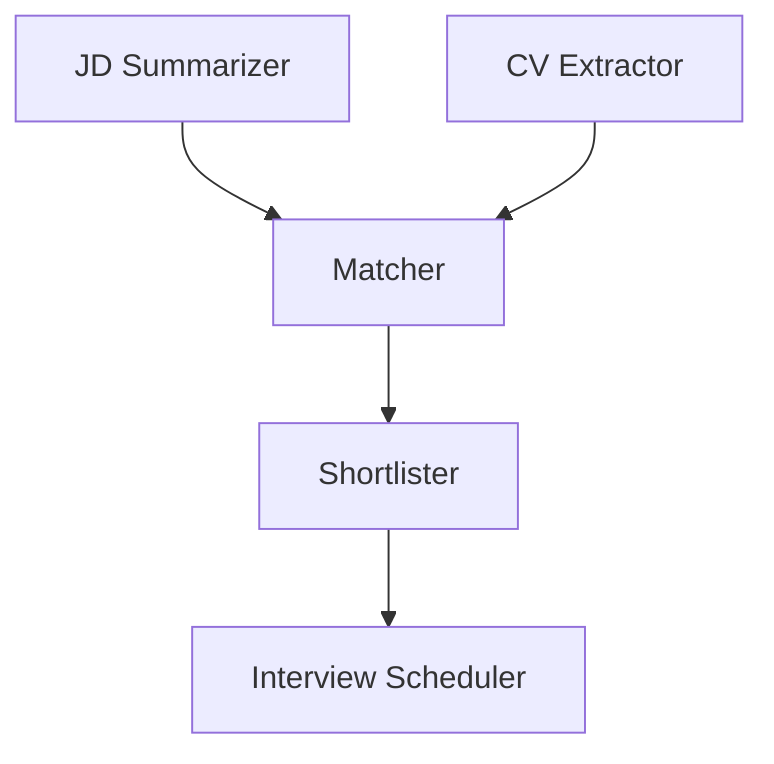

# Talent Match - Multi-Agent AI Job Screening

Talent Match is a Python project that simulates an end-to-end AI-assisted recruitment pipeline:

1. Parse and summarize job descriptions
2. Extract candidate details from resumes
3. Score JD-CV fit
4. Shortlist top candidates
5. Draft interview outreach

It supports both a Streamlit UI and a CLI workflow, with SQLite persistence for run history.

## Why this project

- Demonstrates a modular multi-agent architecture for hiring workflows
- Combines structured extraction + scoring + decision logic
- Provides visual outputs (agent interaction diagrams)
- Includes a lightweight demo mode for quick validation

## Architecture

The pipeline is organized into specialized agents:

- **JD Summarizer**: reads and structures role requirements from `job_description.csv`
- **CV Extractor**: parses resume files and builds candidate profiles
- **Matcher**: computes fit scores between jobs and candidates
- **Shortlister**: filters candidates above a threshold
- **Emailer**: generates/simulates interview invitations

## Repository Structure

```text
Talent_Match/
├── app.py                     # Streamlit application
├── main.py                    # CLI pipeline entry point
├── demo.py                    # Lightweight demo (less dependency heavy)
├── job_description.csv        # Job description input data
├── requirements.txt           # Python dependencies
├── test_db.py                 # DB checks/tests
├── test_ollama.py             # Ollama integration check
├── README.md
├── SUMMARY.md
├── agent_diagram.md
├── agent_diagram_demo.md
├── agents/
│   ├── jd_summarizer.py
│   ├── cv_extractor.py
│   ├── matcher.py
│   ├── shortlister.py
│   └── emailer.py
├── db/
│   └── memory.py              # SQLite memory/persistence layer
└── utils/
        └── diagram.py             # Mermaid/Matplotlib diagram generation
```

## Tech Stack

- Python 3.10+
- Streamlit
- Pandas, NumPy, scikit-learn
- Matplotlib, NetworkX
- PyMuPDF
- Ollama (optional, for local LLM/embedding workflows)
- SQLite (built-in)

## Getting Started

### 1) Create and activate virtual environment

**Windows (PowerShell)**

```powershell
python -m venv venv
venv\Scripts\Activate.ps1
```

### 2) Install dependencies

```bash
pip install -r requirements.txt
```

### 3) Prepare input data

- Ensure `job_description.csv` exists and is populated
- Place resume PDFs in a `resumes/` folder (used by `main.py` and `demo.py`)

## Run the Project

### Streamlit UI

```bash
streamlit run app.py
```

### CLI pipeline

Show all options:

```bash
python main.py --help
```

Typical run:

```bash
python main.py --jd-file job_description.csv --resumes-dir resumes --db-file memory.db --threshold 80 --diagram-type mermaid
```

Enable interview email simulation:

```bash
python main.py --send-emails
```

### Lightweight demo

```bash
python demo.py
```

## CLI Arguments (`main.py`)

- `--jd-file` (default: `job_description.csv`)
- `--resumes-dir` (default: `resumes`)
- `--db-file` (default: `memory.db`)
- `--threshold` (default: `80.0`)
- `--send-emails` (flag)
- `--diagram-type` (`mermaid` or `matplotlib`, default: `mermaid`)

## Data and Generated Outputs

- **Input**:
    - `job_description.csv`
    - `resumes/*.pdf`
- **Database**:
    - `memory.db`
- **Diagrams**:
    - `agent_diagram.md`
    - `agent_diagram.png`
    - `agent_diagram_demo.md`

## Validation and Checks

Run quick checks:

```bash
python test_db.py
python test_ollama.py
```

## Troubleshooting

- **No resumes found**: verify the `resumes/` directory exists and contains PDF files.
- **Ollama-related errors**: ensure Ollama is installed and running locally before executing Ollama-dependent flows.
- **Matplotlib diagram issues**: rerun with `--diagram-type mermaid`.
- **Encoding issues in JD CSV**: use UTF-8 encoding where possible.

## Agent Flow



## Future Enhancements

- Better ranking explainability per candidate
- Configurable weighting by role type
- ATS/API integration
- Exportable shortlist reports
