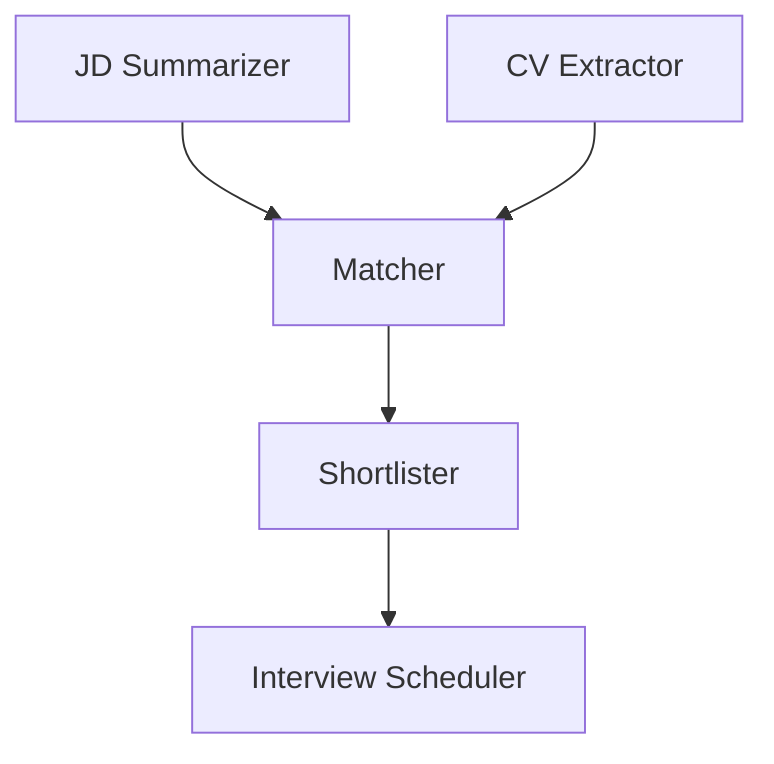

# Talent Match - Multi-Agent AI Job Screening

Talent Match is a Python-based job screening system that simulates an AI recruitment pipeline: parse job descriptions, process resumes, score candidates, shortlist top matches, and generate interview outreach.

## Features

- Multi-step screening workflow (JD analysis -> CV extraction -> matching -> shortlisting -> email drafting)
- Streamlit interface for interactive demo and visualization
- CLI flow for pipeline-style execution
- SQLite-based local persistence for run history
- Demo mode (`demo.py`) that works even in lightweight environments

## Current Workspace Layout

This repository snapshot currently includes:

```
Talent_Match/
├── app.py
├── main.py
├── demo.py
├── job_description.csv
├── requirements.txt
├── test_db.py
├── test_ollama.py
├── memory.db
├── agent_diagram.md
├── agent_diagram.png
└── README.md
```

## Tech Stack

- Python 3.10+
- Streamlit, Pandas, NumPy
- Matplotlib, NetworkX
- Scikit-learn
- PyMuPDF
- Ollama (for local embedding/model workflows)
- SQLite (built-in)

## Quick Start

### 1) Create and activate virtual environment (Windows PowerShell)

```powershell
python -m venv venv
venv\Scripts\Activate.ps1
```

### 2) Install dependencies

```bash
pip install -r requirements.txt
```

### 3) Run options

- **Streamlit UI**

```bash
streamlit run app.py
```

- **CLI pipeline**

```bash
python main.py --help
```

- **Lightweight demo**

```bash
python demo.py
```

## Data and Outputs

- Input JD file: `job_description.csv`
- Local DB file: `memory.db`
- Generated diagrams: `agent_diagram.md`, `agent_diagram.png`, `agent_diagram_demo.md`

## Notes

- If using Ollama-based features, ensure Ollama is installed and running locally.
- Some flows depend on additional modules referenced in scripts; `demo.py` is the easiest way to validate environment setup quickly.

## Agent Flow


